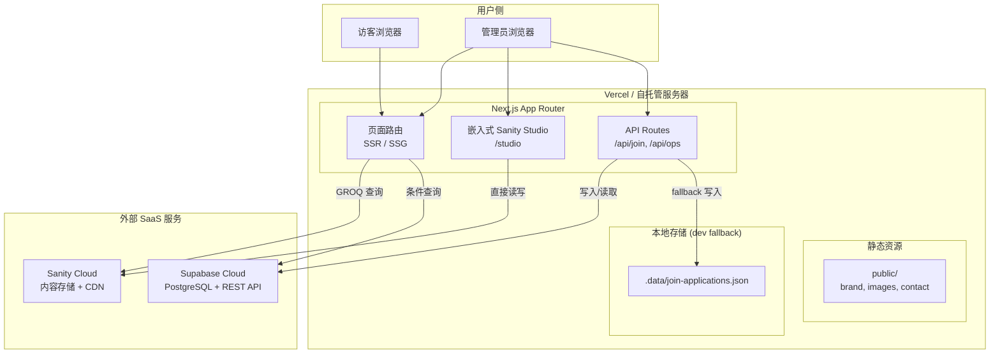
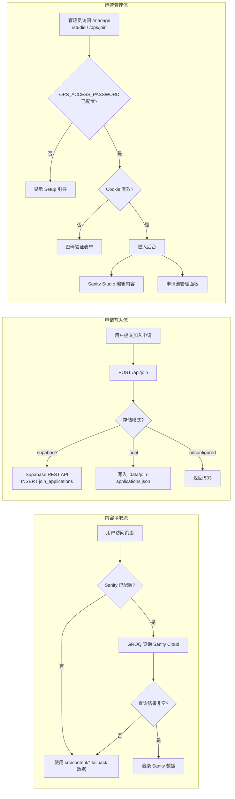
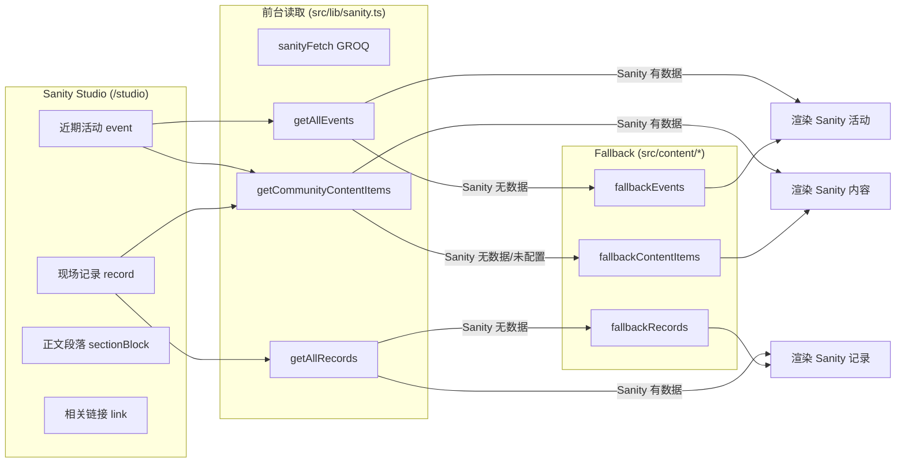
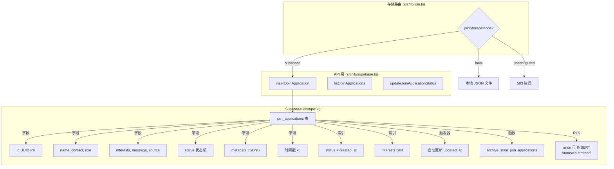
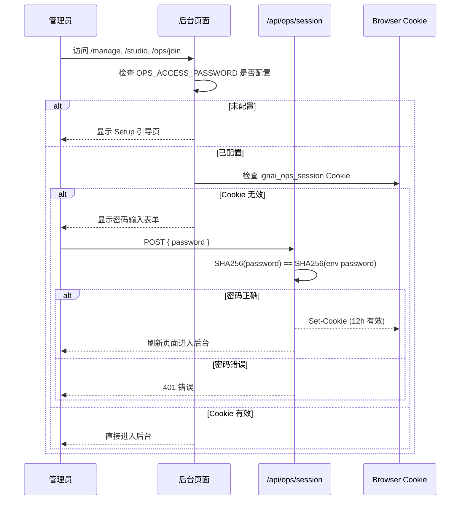
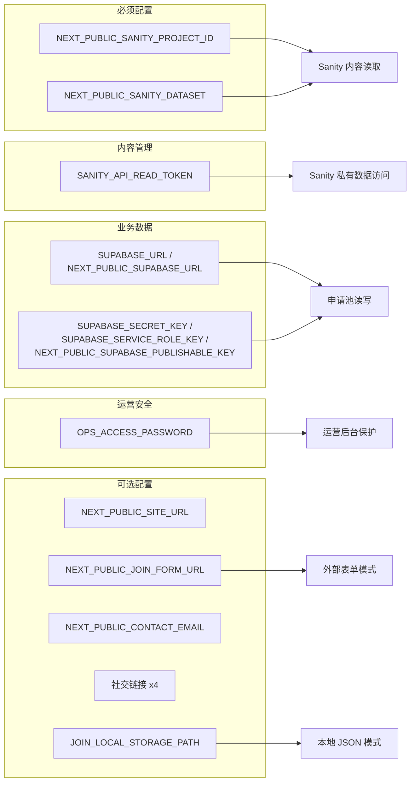
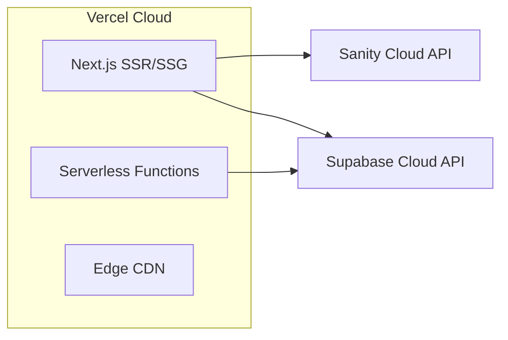
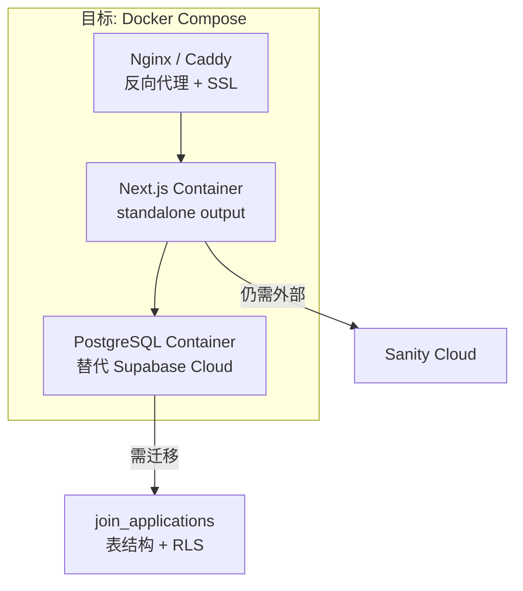
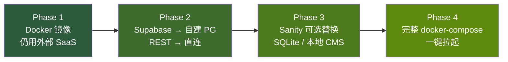
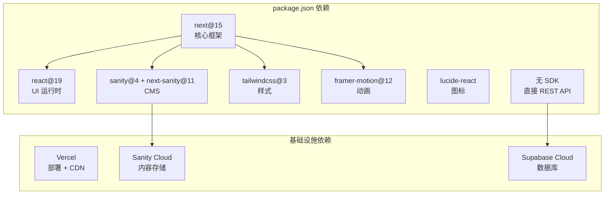

# IGNAI 社区官网 -- 全栈架构分析

> 最后更新：2026-05-06
> 分析范围：当前 `codex/aesthetic-spacing-preview` 分支全量源码

---

## 1. 项目概览

IGNAI 官网是一个基于 **Next.js 15 (App Router)** 的社区落地页项目，核心定位：

- 社区展示（首页、活动、记录、故事、博客）
- 内容管理（嵌入式 Sanity Studio）
- 加入申请（Supabase + 本地 JSON 双模存储）
- 运营后台（密码门 + 申请池管理）

---

## 2. 技术栈一览

| 层级 | 技术选型 | 用途 |
|------|---------|------|
| 框架 | Next.js 15 (App Router, React 19) | SSR/SSG 前端框架 |
| 样式 | Tailwind CSS 3 + 自定义 Design Tokens | 原子化 CSS |
| 动画 | Framer Motion 12 | 页面动效 |
| 图标 | Lucide React | SVG 图标库 |
| CMS | Sanity v4 (next-sanity 11) | 内容编辑后台 |
| 数据库 | Supabase (PostgreSQL) | 业务数据（申请池） |
| 部署 | Vercel | Git-push 自动部署 |
| 语言 | TypeScript 5.8 | 类型安全 |
| 测试 | Playwright (smoke test) | 端到端冒烟测试 |

---

## 3. 系统架构总览图



---

## 4. 数据流架构图



---

## 5. 目录结构拆解

```
IGN AI 官网/
├── src/
│   ├── app/                        # Next.js App Router 页面
│   │   ├── page.tsx                # 首页 (Section 组合)
│   │   ├── layout.tsx              # 全局 Layout (字体、SEO、OG)
│   │   ├── globals.css             # 全局样式 + Design Tokens
│   │   ├── robots.ts               # SEO robots
│   │   ├── sitemap.ts              # 动态 Sitemap
│   │   ├── not-found.tsx           # 404 页面
│   │   │
│   │   ├── blog/                   # 博客模块
│   │   │   ├── page.tsx            # 博客列表
│   │   │   └── [slug]/page.tsx     # 博客详情
│   │   │
│   │   ├── events/                 # 活动模块
│   │   │   ├── page.tsx            # 活动列表
│   │   │   └── [slug]/page.tsx     # 活动详情
│   │   │
│   │   ├── stories/                # 故事模块
│   │   │   ├── page.tsx            # 故事列表
│   │   │   └── [slug]/page.tsx     # 故事详情
│   │   │
│   │   ├── records/                # 社区记录模块
│   │   │   ├── page.tsx            # 记录列表
│   │   │   └── [slug]/page.tsx     # 记录详情
│   │   │
│   │   ├── join/page.tsx           # 加入社区页
│   │   │
│   │   ├── studio/[[...tool]]/     # 嵌入式 Sanity Studio
│   │   │   ├── page.tsx            # Studio 入口 (含权限门)
│   │   │   └── StudioClient.tsx    # Studio 客户端组件
│   │   │
│   │   ├── manage/                 # 管理后台
│   │   │   ├── page.tsx            # 后台首页
│   │   │   ├── content/page.tsx    # 内容发布台
│   │   │   ├── join/page.tsx       # 申请池
│   │   │   └── members/page.tsx    # 成员管理 (预留)
│   │   │
│   │   ├── ops/join/page.tsx       # 运营后台 - 申请池
│   │   │
│   │   └── api/                    # API 路由
│   │       ├── join/route.ts       # 提交加入申请
│   │       ├── join/submissions/   # 申请 CRUD
│   │       │   ├── route.ts        # 列表查询
│   │       │   └── [id]/route.ts   # 单条操作
│   │       └── ops/session/route.ts # 运营登录/登出
│   │
│   ├── components/                 # 组件库
│   │   ├── admin/                  # 管理后台组件
│   │   │   ├── AdminShell.tsx      # 后台布局骨架
│   │   │   ├── OpsAccessGate.tsx   # 密码验证门
│   │   │   ├── adminConfig.ts      # 后台导航配置
│   │   │   └── JoinSubmissionsPanel.tsx
│   │   ├── cards/                  # 卡片组件
│   │   ├── content/                # 内容管理组件
│   │   ├── forms/                  # 表单组件 (JoinApplicationForm)
│   │   ├── layout/                 # 布局组件 (Header, Footer, PageShell)
│   │   ├── motion/                 # 动画组件 (BackgroundFX, Reveal)
│   │   ├── sections/               # 首页 Section 组件 (13 个)
│   │   └── ui/                     # 通用 UI 组件
│   │
│   ├── content/                    # 静态 Fallback 内容
│   │   ├── community.ts            # 社区角色、文化
│   │   ├── events.ts               # 活动 Fallback 数据 + 类型
│   │   ├── records.ts              # 记录 Fallback 数据 + 类型
│   │   ├── platform.ts             # 平台展示内容 + Fallback
│   │   ├── links.ts                # 社交链接配置
│   │   └── site.ts                 # 站点文案配置
│   │
│   ├── lib/                        # 核心业务逻辑
│   │   ├── sanity.ts               # Sanity 客户端 + GROQ 查询
│   │   ├── supabase.ts             # Supabase REST 封装
│   │   ├── join.ts                 # 申请存储路由层
│   │   ├── events.ts               # 活动数据获取 (Sanity → fallback)
│   │   ├── records.ts              # 记录数据获取 (Sanity → fallback)
│   │   ├── opsAuth.ts              # 运营后台认证 (SHA256 + Cookie)
│   │   ├── motion.ts               # 动画配置
│   │   └── utils.ts                # 工具函数
│   │
│   ├── sanity/                     # Sanity 配置
│   │   ├── env.ts                  # 环境变量
│   │   ├── structure.ts            # Studio 侧边栏结构
│   │   └── schemaTypes/            # Schema 定义
│   │       ├── index.ts            # Schema 注册
│   │       ├── event.ts            # 活动 Schema
│   │       ├── record.ts           # 记录 Schema
│   │       ├── sectionBlock.ts     # 正文段落 Schema
│   │       └── link.ts             # 链接 Schema
│   │
│   └── styles/
│       └── tokens.css              # Design Tokens CSS 变量
│
├── supabase/
│   └── sql/
│       └── 001_join_applications.sql  # 建表 + 触发器 + RLS
│
├── scripts/
│   └── smoke-test.mjs              # Playwright 冒烟测试
│
├── public/                         # 静态资源
│   ├── brand/                      # Logo
│   ├── contact/                    # 联系二维码
│   └── images/                     # 占位图
│
├── doc/                            # 项目文档
├── sanity.config.ts                # Sanity 根配置
├── sanity.cli.ts                   # Sanity CLI 配置
├── next.config.ts                  # Next.js 配置
├── vercel.json                     # Vercel 部署配置
├── tailwind.config.ts              # Tailwind 配置
├── agent.md                        # Agent 协作规范
└── package.json
```

---

## 6. 核心模块分析

### 6.1 内容层 -- Sanity CMS



**关键设计**：每个内容类型都有 **Sanity 优先 + 硬编码 fallback** 的双模策略。Sanity 未配置或查询结果为空时，页面不会崩溃，而是显示 `src/content/` 中的预设内容。

**当前 Sanity Schema**：

| Schema | 用途 | 关键字段 |
|--------|------|---------|
| `event` | 活动管理 | title, slug, status, dateText, location, format, coverImage, excerpt, registrationUrl, audience, agenda, hosts, notes, content |
| `record` | 社区记录 | title, slug, type(recap/story/resource/project), dateText, coverImage, excerpt, outcomes, tags, content, links |
| `sectionBlock` | 正文段落 | heading, body |
| `link` | 外部链接 | label, href |

### 6.2 业务数据层 -- Supabase



**申请状态流转**：

```
submitted → reviewing → contacted → accepted
                                         ↓
                           waitlisted → archived
                                         ↓
                           withdrawn   spam
```

**关键设计**：
- 不使用 `@supabase/supabase-js` SDK，而是直接调用 Supabase REST API（`fetch`），减少依赖
- 支持 3 级 key 降级：`SECRET_KEY` → `SERVICE_ROLE_KEY` → `PUBLISHABLE_KEY`
- 本地开发时自动 fallback 到 JSON 文件存储

### 6.3 认证层 -- 运营后台保护



**关键设计**：
- 使用 `timingSafeEqual` 防止时序攻击
- Cookie 设置 `httpOnly`, `sameSite=lax`, 生产环境 `secure`
- 12 小时过期
- 不是完整的用户认证系统，而是简单的共享密码门

### 6.4 前端组件架构

```mermaid
graph TB
    subgraph "全局"
        Layout[RootLayout<br/>字体 + SEO + OG]
        Layout --> Header[SiteHeader<br/>导航栏]
    end

    subgraph "首页 (page.tsx)"
        HP[HomePage]
        HP --> BG[PageBackdrop + BackgroundFX]
        HP --> H1[HeroSection]
        HP --> H2[WhatIsSection]
        HP --> H3[CultureSection]
        HP --> H4[UpcomingEventsSection]
        HP --> H5[FieldNotesSection]
        HP --> H6[CommunityRolesSection]
        HP --> H7[JoinSection]
        HP --> FT[Footer]
    end

    subgraph "详情页模板"
        LP[ListPage<br/>events/records/blog/stories]
        DP[DetailPage<br/>[slug]/page.tsx]
        LP --> CC[ContentCard]
        DP --> PH[PageHero]
        DP --> DS[DetailSection]
    end

    subgraph "管理后台"
        MP[ManagePage]
        MP --> AS[AdminShell<br/>侧边栏 + 内容区]
        MP --> OG[OpsAccessGate<br/>密码门]
        MP --> JSP[JoinSubmissionsPanel]
    end

    subgraph "通用 UI"
        CT[CTAButton]
        AH[AnimatedHeading]
        GO[GlowOrb]
        SC[SectionContainer]
        RV[Reveal 动画]
    end

    H4 & H5 --> CC
    AS --> OG
```

---

## 7. 环境变量依赖关系



---

## 8. 与 NotionNext 的对比

你提到你的博客项目是基于 NotionNext 二开的，这里做一个关键差异对比：

| 维度 | NotionNext | IGNAI 官网 |
|------|-----------|-----------|
| 内容源 | Notion Database | Sanity CMS |
| 内容获取 | Notion API | GROQ 查询 |
| 编辑体验 | Notion 原生编辑器 | Sanity Studio (嵌入式) |
| 数据库 | 无 / 外部 | Supabase PostgreSQL |
| 后台认证 | 无 | OPS 密码门 |
| 部署 | Vercel | Vercel |
| 框架 | Next.js | Next.js 15 App Router |
| 样式 | Tailwind | Tailwind + Design Tokens |
| 动画 | 无 / 简单 | Framer Motion |
| 测试 | 无 | Playwright smoke test |

**核心差异**：NotionNext 把 Notion 同时当作 CMS 和数据库用，而 IGNAI 把这两个职责拆分到了 Sanity（CMS）和 Supabase（数据库）上。

---

## 9. 当前架构的鲁棒性评估

### 9.1 优点

| 维度 | 现状 | 评价 |
|------|------|------|
| 内容容错 | 每个内容类型都有 fallback | 很好。Sanity 挂了或未配置，页面仍能正常显示 |
| 存储容错 | Supabase / 本地 JSON / 未配置 三级降级 | 很好。开发环境零配置即可运行 |
| 类型安全 | TypeScript 全覆盖，Supabase 类型手写 | 良好 |
| SEO | 动态 sitemap + robots + OG tags | 良好 |
| 测试 | Playwright smoke test | 有基础覆盖 |
| 安全 | 密码门 + timingSafeEqual + RLS | MVP 阶段够用 |

### 9.2 风险点

| 维度 | 风险 | 严重程度 |
|------|------|---------|
| **平台锁定** | 深度依赖 Vercel + Sanity Cloud + Supabase Cloud，三个 SaaS 的 SLA、定价、地域可用性都不可控 | 中高 |
| **Supabase 直连** | 不使用 SDK 而是直接 REST，意味着没有连接池管理、没有离线重试、没有类型生成 | 中 |
| **认证模型** | 共享密码门，不是真正的用户系统。无法区分多个管理员，无法审计 | 中 |
| **内容缓存** | Sanity 查询使用 `revalidate: 60`，但没有 ISR stale-while-revalidate 的精细控制 | 低 |
| **无 ORM** | Supabase 直接拼接 REST URL，SQL 注入风险较低（使用 eq 参数化），但缺少编译时查询校验 | 低 |
| **本地文件存储** | `.data/join-applications.json` 在 Vercel 上是只读文件系统，生产环境无法使用 local 模式 | 已知限制，不影响生产 |
| **缺少监控** | 没有 APM、日志收集或错误追踪 | 中 |

---

## 10. Docker 化 & 自托管迁移评估

### 10.1 当前部署模型



### 10.2 迁移到 Docker 自托管需要解决的问题



#### 需要改动的部分：

| 改动项 | 工作量 | 说明 |
|--------|--------|------|
| **Next.js standalone 输出** | 小 | `next.config.ts` 加 `output: "standalone"`，Dockerfile 约 20 行 |
| **Sanity Studio 嵌入式** | 无 | Studio 已经嵌入 Next.js，随应用一起部署 |
| **Supabase → 自建 PostgreSQL** | 中 | 需要迁移 REST API 调用为 `pg` 或 Prisma/Drizzle 直连；或自建 PostgREST |
| **RLS 策略** | 中 | PostgreSQL RLS 需要 `supabase_auth` schema 支持，自建需换用应用层权限控制 |
| **图片存储** | 中 | Sanity 图片走 CDN 无问题；如需本地存储需加 MinIO/S3 |
| **SSL / 域名** | 小 | Caddy 自动 HTTPS，或 Nginx + certbot |
| **环境变量管理** | 小 | `.env.production` 或 Docker secrets |
| **CDN / 缓存** | 中 | Vercel 自带 Edge CDN + ISR，自建需用 Nginx 缓存或 Cloudflare |

### 10.3 推荐的渐进式迁移路径



**Phase 1 -- 最小 Docker 化（1-2 天）**：
- `next.config.ts` 加 `output: "standalone"`
- 写 Dockerfile（多阶段构建，node:20-alpine）
- 仍连接 Sanity Cloud + Supabase Cloud
- docker run 即可运行

**Phase 2 -- 数据库内化（3-5 天）**：
- 加 PostgreSQL 到 docker-compose
- `src/lib/supabase.ts` 的 REST 调用改为 `pg` / Drizzle 直连
- 迁移 `supabase/sql/` 中的建表语句
- RLS 策略改为应用层校验（已有 `opsAuth` 基础）

**Phase 3 -- CMS 内化（可选，5-10 天）**：
- 选项 A：继续用 Sanity Cloud（免费额度足够小项目）
- 选项 B：迁移到本地 CMS（如 Keystone.js、Payload CMS）
- 选项 C：简化为 Markdown/MDX 文件（类似 NotionNext 的静态生成模式）

**Phase 4 -- 完整一键部署（2-3 天）**：
- docker-compose.yml 编排 Next.js + PostgreSQL + Nginx/Caddy
- 环境变量模板
- 健康检查 + 自动重启

---

## 11. 依赖关系图



**值得注意**：`package.json` 中没有 `@supabase/supabase-js`，所有 Supabase 交互都是通过原生 `fetch` 调用 REST API 完成的。这减少了一个依赖，但也失去了 SDK 的类型安全和自动重连能力。

---

## 12. 总结与建议

### 当前状态判断

这个项目是一个 **MVP 阶段的小型全栈社区官网**，架构决策整体合理：

1. **Sanity 做内容管理** -- 编辑体验好，嵌入式 Studio 免去独立部署
2. **Supabase 做业务数据** -- 免费额度够用，REST API 简单直接
3. **Vercel 做部署** -- 零运维成本
4. **Fallback 策略** -- Sanity 和 Supabase 都有降级方案，鲁棒性好

### 短期建议（1-2 周）

1. 补充 `.env.example` 的实际值说明文档
2. `src/lib/supabase.ts` 考虑引入 `@supabase/supabase-js` 或至少加错误重试
3. 加基础监控（Vercel 自带 Analytics + Speed Insights 就够）

### 中期建议（1-3 个月）

1. 如需自托管，按 Phase 1-4 渐进迁移
2. 认证系统升级 -- 共享密码门 → NextAuth.js / Clerk（支持多管理员 + 审计）
3. 成员管理模块落地（已有预留）

### 关于 NotionNext 对比

你的 NotionNext 博客把 Notion 当万能后端（CMS + 数据库），好处是极简（一个平台搞定一切），坏处是 Notion API 的性能和灵活性受限。IGNAI 的多平台缝合（Sanity + Supabase + Vercel）在能力上更强，但确实增加了运维复杂度和迁移成本。

**如果目标是最终自托管**，建议尽早做 Phase 1（Docker 镜像化），即使仍用外部 SaaS，至少保证应用本身可以脱离 Vercel 独立运行。
