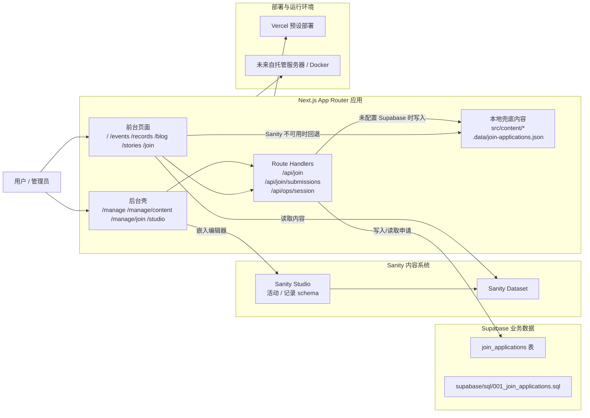
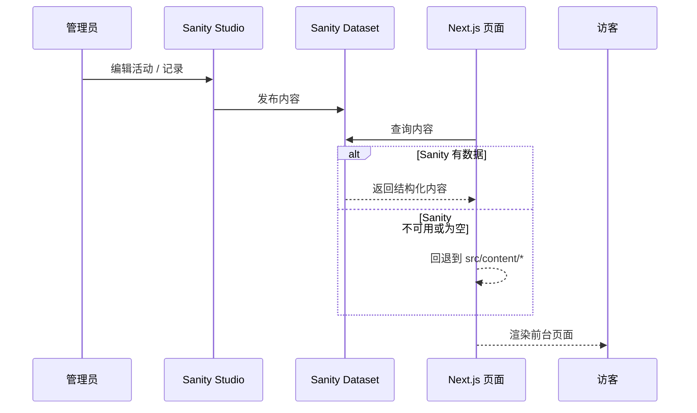
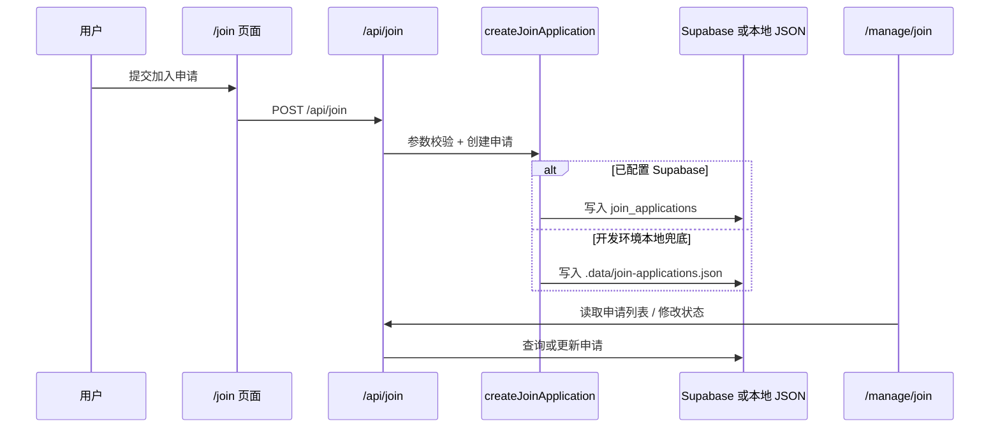
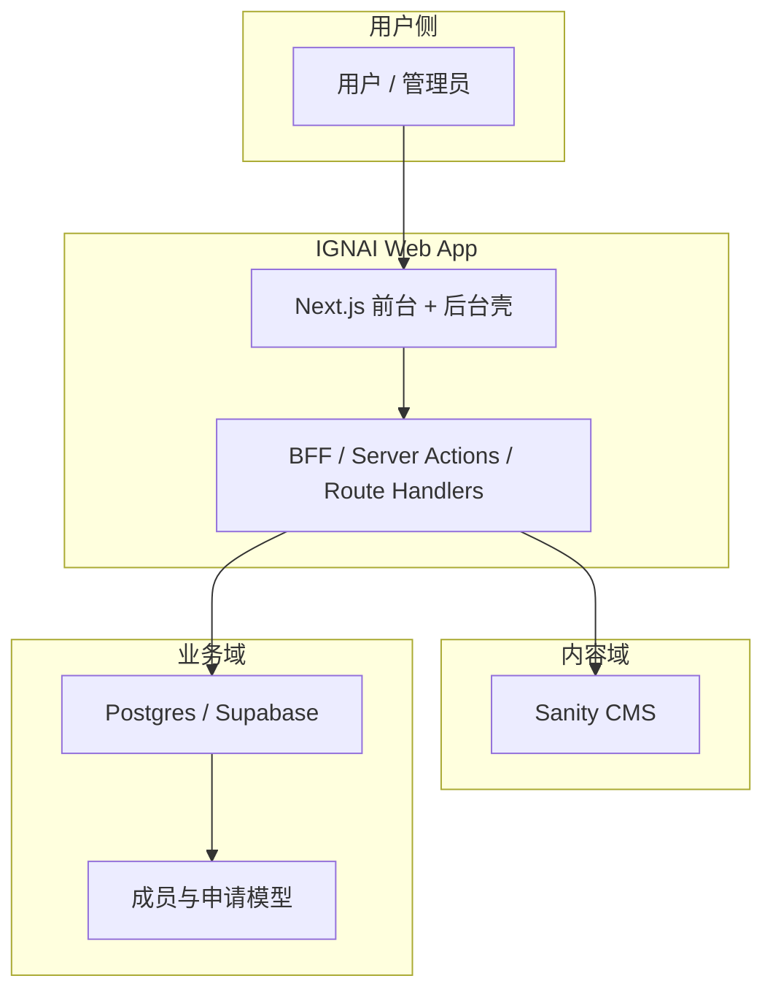

# IGNAI 当前项目架构分析

## 1. 文档目标

这份文档不是重新设计一个理想化架构，而是先把 **当前项目到底由哪些平台拼起来、每个平台负责什么、哪里稳、哪里不稳、后面怎么迁移到服务器部署** 讲清楚。

你可以把它当成三件事的合体：

1. 当前项目的真实架构拆解
2. 当前方案的鲁棒性 / 延展性评估
3. 面向服务器部署与 Docker 化的收敛建议

---

## 2. 一句话结论

当前项目本质上是一个 **以 Next.js 为主壳的社区官网**，外接了两套核心外部能力：

1. `Sanity` 负责内容管理与编辑体验
2. `Supabase` 负责加入申请这类业务数据

再加上一层项目内部实现的：

3. `manage` / `studio` / `ops` 这套后台壳与权限门

所以它并不是“乱缝合”，而是一个典型的 **Headless CMS + BaaS + 前端壳层** 架构。  
真正的问题不在于平台多，而在于：

- 内容后台和业务后台是两条技术链路
- 本地开发、Vercel 部署、未来服务器部署这三种运行环境的行为还没有完全统一
- 降级策略存在，但生产级闭环还不完整
- Docker 一键部署目前只能装下 `Next.js` 本体，装不下外部平台本身

---

## 3. 当前架构总览



---

## 4. 当前架构拆解

## 4.1 前端主壳：Next.js 15 App Router

当前项目的核心运行时就是一个 Next.js 应用，主要承担四类职责：

1. 前台官网渲染
2. 后台工作台壳层
3. API 路由
4. 外部平台的整合入口

关键目录：

- `src/app/*`：页面路由
- `src/components/*`：界面组件
- `src/lib/*`：数据访问与能力封装
- `src/content/*`：本地兜底内容

这个层是整个系统的“统一门面”，也是未来最适合被 Docker 化、被自托管的那一层。

---

## 4.2 内容系统：Sanity

### 当前承担的职责

Sanity 现在已经是内容后台的核心：

- 活动 `event`
- 现场记录 `record`
- Studio 编辑器
- 内容 schema 和内容结构化管理

对应文件：

- `sanity.config.ts`
- `src/sanity/schemaTypes/event.ts`
- `src/sanity/schemaTypes/record.ts`
- `src/app/studio/[[...tool]]/page.tsx`
- `src/lib/sanity.ts`

### 当前接法的特点

这是一个典型的 Headless CMS 接法：

- 内容录入在 Sanity Studio
- 前台展示在 Next.js
- 页面通过 `next-sanity` 拉取数据
- `Sanity` 不可用或无内容时，回退到 `src/content/*`

这套设计的优点很明显：

- 编辑体验好
- 结构化内容强
- 扩新内容类型成本低
- 不需要自己从零做富文本和后台编辑器

但它天然意味着：

- 内容系统不是你 Docker 里的一部分
- 你的“完整应用”不是一个单容器
- 自托管时要么继续依赖 Sanity SaaS，要么未来换 CMS

---

## 4.3 业务数据系统：Supabase

### 当前承担的职责

Supabase 现在主要用于承接加入申请：

- 表单提交
- 申请池列表
- 状态流转
- 生命周期字段

关键文件：

- `src/lib/supabase.ts`
- `src/lib/join.ts`
- `src/app/api/join/route.ts`
- `src/app/api/join/submissions/route.ts`
- `src/app/api/join/submissions/[id]/route.ts`
- `supabase/sql/001_join_applications.sql`

### 当前表结构特点

`join_applications` 这张表已经不是玩具表，已经有一些业务化设计：

- `status` 状态流转
- `metadata` 扩展字段
- `reviewed_at / contacted_at / resolved_at / archived_at`
- `delete_after`
- 索引
- trigger 自动更新时间
- archive function

这说明这条业务线已经有继续扩展成成员运营系统的基础。

### 当前接法的特点

你现在没有引入完整的 Supabase SDK，而是直接调用 REST 接口。

好处：

- 依赖更轻
- 更透明
- 更容易理解真实读写过程

问题：

- 认证、错误处理、重试、类型绑定都要自己兜
- 后续业务一多，REST 拼 URL 的维护成本会上升
- 未来如果加入更多表、RLS 规则、Storage、Auth，会越来越分散

---

## 4.4 后台平台层：`/manage` + `/studio` + `/ops`

这是当前项目很关键的一层，也是你“从零到一拼架构”的真实体现。

它不是一个独立后台系统，而是一个 **前端内嵌式后台平台层**：

- `/manage`：后台首页
- `/manage/content`：内容发布工作台
- `/manage/join`：申请池
- `/studio`：Sanity Studio 真编辑器
- `/ops/join`：旧入口重定向

你实际上做的是：

1. 用 Next.js 做了一层后台统一入口
2. 用权限门把后台区域收拢
3. 把 Sanity Studio 作为内容引擎嵌入进来
4. 把 Supabase 申请池接成第二块后台能力

这个方向是对的，因为它在用户体验上把多平台“看起来像一个后台”了。

但要注意：  
**现在它是“统一入口”，还不是“统一后台内核”。**

原因是：

- 内容数据在 Sanity
- 业务数据在 Supabase
- 权限只是在 Next.js 壳层自己做了一套简单门禁
- 没有统一用户体系
- 没有统一角色 / 权限模型

---

## 4.5 本地兜底层：`src/content/*` + `.data/*`

当前项目有两种降级兜底：

### 内容兜底

- `src/content/events.ts`
- `src/content/records.ts`
- `src/content/platform.ts`

当 Sanity 不可用、无内容或查询失败时，页面仍然能展示默认内容。

### 表单数据兜底

- `.data/join-applications.json`

当 Supabase 未配置时，非生产环境会回退到本地 JSON。

这是很实用的开发期策略，说明你在考虑“先跑通，再逐步接真实后端”。

但这套策略在生产环境要非常小心：

- 本地 JSON 不适合多实例
- 容器重启可能丢失本地状态
- 横向扩容时会直接失效
- 只能用于开发联调，不能当生产存储

---

## 5. 当前系统的真实数据流

## 5.1 内容流



### 评价

这条链路是当前项目里最成熟的一条。

原因：

- 内容结构明确
- 编辑链路清楚
- 前台读模型简单
- 有兜底内容

它的问题不在“能不能用”，而在“未来是否继续绑定 Sanity SaaS”。

---

## 5.2 加入申请流



### 评价

这条链路已经具备最小业务闭环，但还没有完全企业化：

- 有录入
- 有列表
- 有状态变更
- 有生命周期字段

但还没有：

- 操作日志
- 成员转化链路
- CRM 化标签体系
- 更细的权限模型
- 文件上传 / 附件
- 审批流 / 指派流

所以它现在更像一个 **早期运营收件箱**，不是成熟后台系统。

---

## 6. 当前架构的鲁棒性分析

## 6.1 强项

### 1. 内容层有降级能力

Sanity 失效时，前台不会直接空白，这一点很好。

### 2. 内容和业务已经自然分层

内容进 CMS，业务进数据库，这个方向是健康的。

### 3. 后台入口已经被收口

虽然还不是统一内核，但至少操作入口已经从“散链接”变成了“后台平台”。

### 4. 数据模型有扩展意识

`metadata`、状态字段、时间字段、SQL 索引，说明你不是只做静态页面，而是在为后续业务化留空间。

---

## 6.2 脆弱点

### 1. 权限体系很轻，只适合早期

当前后台权限本质上是：

- 一个 `OPS_ACCESS_PASSWORD`
- 一个 cookie 会话
- 基于 Next.js 页面门禁

这足够做早期小团队后台，但不适合多人协作后台：

- 没有账号体系
- 没有角色体系
- 无法区分编辑、运营、管理员
- 密码一旦共享，就无法审计责任

### 2. 业务数据的本地兜底不能进入生产

`.data/join-applications.json` 这条线只能作为开发兜底，不适合未来服务器化和容器化。

### 3. 外部平台依赖多，但没有统一环境契约

当前运行依赖分散在：

- Next.js
- Sanity
- Supabase
- Vercel 环境变量

一旦迁移服务器，最容易出问题的不是代码，而是：

- 环境变量漏配
- 回调域名 / CORS
- 生产构建与本地行为不一致
- 内容平台和业务平台的访问权限没有一次性梳理

### 4. 当前“统一后台”更多是 UI 统一，不是系统统一

现在统一的是入口和页面视觉，不是：

- 身份系统
- 数据域
- 审计模型
- 发布模型

所以继续加功能时，后台会越来越像“多个系统贴在一起”。

### 5. Docker 只能打包应用壳，打不包外部 SaaS

这正是你现在感到“不适合一键拉齐”的核心原因。

如果继续使用：

- Sanity Cloud
- Supabase Cloud

那么 Docker 化的只是：

- Next.js 应用
- 本地静态资源
- Node 运行环境

不是完整业务系统。

---

## 7. 当前架构的延展性分析

## 7.1 适合继续扩展的部分

### 1. 内容模型

Sanity schema 很适合继续扩展：

- 成员故事
- 项目展示
- 资源库
- 合作案例
- 社区周报

### 2. 业务模型

Supabase 表结构已经能继续长出：

- 成员表
- 活动报名表
- 跟进记录表
- 社群关系表
- 项目协作表

### 3. 前台路由结构

当前 `src/app` 路由结构已经比较清晰，适合继续扩：

- `/members`
- `/projects`
- `/resources`
- `/partners`
- `/admin/*`

---

## 7.2 继续扩展时的风险

### 1. 内容域和业务域可能越长越散

如果后面把成员资料一部分放 Sanity，一部分放 Supabase，会很容易出现：

- 一个人在两个系统里各有一份资料
- 发布展示和运营状态分离
- 修改路径变长

这会让后台越来越难理解。

### 2. 管理后台会出现双核心

继续下去会形成：

- Sanity 负责内容编辑核心
- 自建 manage 负责业务运营核心

这并不一定错，但你必须承认它是“双核心后台”，然后围绕它设计边界，而不是假装它是一个系统。

### 3. 服务器部署时责任边界不清

未来上服务器后，如果不提前定义边界，会出现三个问题：

1. 哪些服务必须自托管？
2. 哪些服务继续用 SaaS？
3. Docker Compose 到底拉起哪些容器才算“部署成功”？

---

## 8. 为什么它现在不容易“一键 Docker 拉齐”

你现在的直觉是对的，因为当前项目并不是单体应用，而是“单入口、多外部系统”的组合。

### 如果现在立刻做 Docker

你最多能稳定打包这些：

- Next.js 应用容器
- 静态资源
- Node 运行环境

但你仍然要依赖外部：

- Sanity 项目
- Supabase 项目
- 环境变量
- 第三方报名链接 / 社交链接

所以它不是：

```text
docker compose up
= 整个业务系统完整启动
```

而更像：

```text
docker compose up
= 本地应用壳启动
前提是外部 SaaS 已存在且环境变量正确
```

这两者差别很大。

---

## 9. 迁移到服务器部署时，建议先做的架构判断

这里最关键的问题不是“要不要 Docker”，而是先决定你要哪一种目标架构。

## 9.1 方案 A：继续 SaaS 化，服务器只托管 Next.js

### 结构

- Next.js 自托管
- Sanity 继续云端
- Supabase 继续云端

### 优点

- 迁移最轻
- 风险最小
- 不用自己维护 CMS 和数据库集群
- 最适合当前阶段

### 缺点

- 不是完整私有化
- Docker 不是全栈闭环
- 外部平台仍是关键依赖

### 适用判断

如果你当前目标是：

- 先稳定上线
- 先把运营跑顺
- 先别被基础设施拖住

那么这是最合适的路线。

---

## 9.2 方案 B：半自托管，Next.js + Postgres 自托管，Sanity 保留云端

### 结构

- Next.js 服务器部署
- Postgres 自托管
- Supabase 能力部分下沉为自有数据库或轻后端
- Sanity 继续作为内容后台

### 优点

- 业务数据掌控力更强
- Docker 化可以先覆盖业务侧
- 成员系统、申请池、运营系统更容易长成自己的后台

### 缺点

- 业务后端复杂度开始上升
- 仍然不是完整单栈
- 你需要开始认真处理认证、备份、迁移、运维

### 适用判断

如果你接下来会重点做：

- 申请池
- 成员库
- 社区 CRM
- 活动报名与签到

那这条路会比继续全依赖 BaaS 更可控。

---

## 9.3 方案 C：全自托管，CMS 和数据库都收回来

### 结构

- Next.js 自托管
- Postgres 自托管
- 文件存储自托管
- CMS 替换或自托管

### 优点

- 架构最统一
- Docker / Compose / K8s 可真正拉齐
- 所有数据和服务边界都可控

### 缺点

- 成本最高
- 维护难度最高
- 你会失去现在 Sanity 带来的编辑效率红利

### 适用判断

只有在以下条件同时成立时才建议：

- 你非常重视私有化
- 你需要完整部署可迁移性
- 你有持续维护服务端的能力

对当前阶段来说，这条路偏重。

---

## 10. 面向下一阶段，我建议的收敛方向

## 10.1 建议的现实路线

我建议你采用：

**短中期走方案 A，结构上按方案 B 的边界来设计。**

翻成更直接的话就是：

- 现在先不要急着把所有平台收回来自托管
- 先接受 `Sanity + Supabase + Next.js` 这套组合
- 但代码结构要开始按“未来可收回业务后端”来拆

这是成本和未来性的平衡点。

---

## 10.2 建议的目标架构



核心思想是：

- `Sanity` 明确只负责内容域
- `Supabase / Postgres` 明确只负责业务域
- `Next.js` 作为统一体验层
- 以后如果你要把业务层迁出来，改动面最小

---

## 11. 推荐的拆分原则

## 11.1 先把“内容”和“业务”边界彻底写死

建议后续强约束如下：

### 内容域放 Sanity

- 活动内容
- 记录内容
- 资源内容
- 成员公开展示页内容

### 业务域放数据库

- 加入申请
- 活动报名
- 成员身份状态
- 跟进记录
- 管理动作

不要让同一类核心实体在两个系统里同时当“主数据源”。

---

## 11.2 后台壳保留，但要承认它是“聚合后台”

你的 `/manage` 非常值得保留，但定位要清楚：

它不是取代 Sanity，而是：

- 统一导航
- 统一权限入口
- 统一运营体验
- 聚合多个后台子系统

换句话说，它应该更像一个 **Admin Portal**，而不是一个试图把所有能力都自己重写的后台。

---

## 11.3 把环境配置标准化

后面无论是不是 Docker，都建议把环境分成三层：

### 核心应用变量

- `NEXT_PUBLIC_SITE_URL`
- `OPS_ACCESS_PASSWORD`

### 内容平台变量

- `NEXT_PUBLIC_SANITY_PROJECT_ID`
- `NEXT_PUBLIC_SANITY_DATASET`
- `SANITY_API_READ_TOKEN`

### 业务平台变量

- `SUPABASE_URL`
- `SUPABASE_SECRET_KEY`
- `SUPABASE_SERVICE_ROLE_KEY`

然后补齐一份真正面向部署的：

- `.env.production.example`
- `docker-compose.yml` 或部署脚本
- 部署前检查清单

---

## 12. 具体改造建议

## 12.1 近期可做

### 1. 新增部署分层文档

明确写清：

- 什么是必须服务
- 什么是外部依赖
- 什么是开发兜底

### 2. 明确本地兜底只用于开发

建议在代码和文档里强调：

- `.data/join-applications.json` 仅开发使用
- 生产必须接真实数据库

### 3. 抽出统一的数据访问层

现在已经有一点雏形：

- `src/lib/sanity.ts`
- `src/lib/supabase.ts`
- `src/lib/join.ts`

后面可以继续往下收敛成：

- `src/domain/content/*`
- `src/domain/join/*`
- `src/domain/member/*`

这样以后迁移后端不会很痛。

---

## 12.2 中期可做

### 1. 把 `join` 升级为真正的成员运营域

从“申请池”长成：

- 申请
- 跟进
- 转成员
- 成员展示控制
- 标签
- 关系记录

### 2. 给后台补统一身份体系

至少升级到：

- 管理员账号
- 角色区分
- 操作审计

### 3. 为服务器部署准备可执行交付物

至少补齐：

- `Dockerfile`
- 生产环境变量模板
- 自托管部署文档
- 外部依赖清单

---

## 12.3 远期可做

### 1. 评估是否保留 Sanity

如果未来你越来越重视：

- 一体化后台
- 完整私有化
- 单系统认知负担

那就可以评估：

- 是否继续用 Sanity
- 是否改成自托管 CMS
- 是否把部分内容编辑能力收回到自己的后台

### 2. 评估是否收回业务后端

如果业务越来越重，建议最终把：

- 成员系统
- 申请池
- 报名数据
- 运营动作

逐步从“轻 BaaS 调用”演进到更可控的业务后端。

---

## 13. 对当前项目的最终判断

## 13.1 这套架构值不值得继续做

值得。

因为它已经具备了一个很重要的特征：

**不是乱写页面，而是在自然长成一个有内容域、有业务域、有后台入口的系统。**

这说明你的方向没有问题。

---

## 13.2 当前最大的问题是什么

不是“平台多”，而是：

- 边界还没被明文定义
- 统一后台还停留在体验层
- 部署模型还没被正式抽象

只要把这三个问题补上，这套架构就会从“拼起来的项目”变成“可持续演进的系统”。

---

## 13.3 最现实的判断

对你当前阶段来说，最优解不是马上追求全自托管，而是：

1. 先接受 `Next.js + Sanity + Supabase` 的组合
2. 把内容域 / 业务域边界明确化
3. 把后台壳定义成聚合后台
4. 把部署模型文档化
5. 等业务真的长出来，再决定收回哪一层

---

## 14. 建议你下一步优先做的三件事

### 1. 先补部署架构文档

把“现在能不能上服务器、Docker 能包哪部分、外部依赖是什么”写成操作文档。

### 2. 先把成员系统的数据归属定下来

成员公开资料放哪，成员运营状态放哪，要现在就定原则。

### 3. 把后台从“页面集合”升级成“后台产品边界”

也就是明确：

- 它统一什么
- 不统一什么
- 哪些能力继续跳 Sanity
- 哪些能力留在自建后台

---

## 15. 附：当前项目的最简认知模型

如果要用一句最短的话来记住当前项目：

```text
这是一个 Next.js 驱动的社区官网，
Sanity 管内容，
Supabase 管业务数据，
/manage 管统一入口，
当前适合继续 SaaS 化演进，
但代码结构应该开始为未来自托管做边界准备。
```
